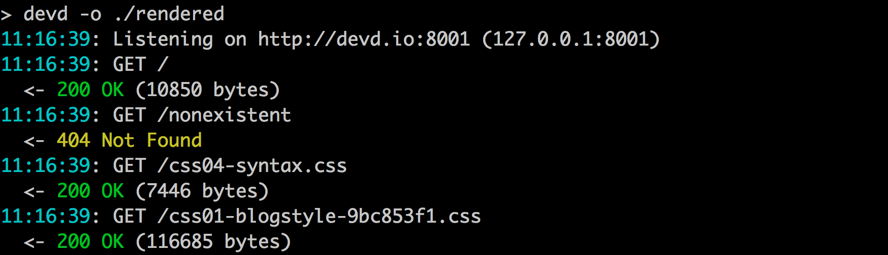

[](https://travis-ci.org/cortesi/devd)
[](https://ci.appveyor.com/project/cortesi/devd/branch/master)


# devd: a local webserver for developers



# Install

Go to the [releases page](https://github.com/cortesi/devd/releases/latest), download the package for your OS, and copy the binary to somewhere on your PATH.

If you have a working Go installation, you can also say

    go get github.com/cortesi/devd/cmd/devd

# Quick start

Serve the current directory, open it in the browser (**-o**), and livereload when files change (**-l**):

```bash
devd -ol .
```

Reverse proxy to http://localhost:8080, and livereload when any file in the **src** directory changes:

```bash
devd -w ./src http://localhost:8080
```


# Using devd with modd

[Modd](https://github.com/cortesi/modd) is devd's sister project - a dev tool
that runs commands and manages daemons in response to filesystem changes. Devd
can be used with modd to rebuild a project and reload the browser when
filesystem changes are detected.

Here's a quick example of a simple *modd.conf* file to illustrate.

```
./src/** {
    prep: render ./src ./rendered
}

./rendered/*.css ./rendered/*.html {
    daemon: devd -m ./rendered
}
```

The first block runs the *render* script whenever anything in the *src*
directory changes. The second block starts a devd instance, and triggers
livereload with a signal whenever a .css or .html file in the *rendered*
directory changes.

See the [modd](https://github.com/cortesi/modd) project page for details.


# Features

### Cross-platform and self-contained

Devd is a single statically compiled binary with no external dependencies, and
is released for OSX, Linux and Windows. Don't want to install Node or Python in
that light-weight Docker instance you're hacking in? Just copy over the devd
binary and be done with it.


### Designed for the terminal

This means no config file, no daemonization, and logs that are designed to be
read in the terminal by a developer. Logs are colorized and log entries span
multiple lines. Devd's logs are detailed, warn about corner cases that other
daemons ignore, and can optionally include things like detailed timing
information and full headers.


### Convenient

To make quickly firing up an instance as simple as possible, devd automatically
chooses an open port to run on (unless it's specified), and can open a browser
window pointing to the daemon root for you (the **-o** flag in the example
above). It also has utility features like the **-s** flag, which auto-generates
a self-signed certificate for devd, stores it in ~/.devd.certs and enables TLS
all in one step.


### Livereload

When livereload is enabled, devd injects a small script into HTML pages, just
before the closing *head* tag. The script listens for change notifications over
a websocket connection, and reloads resources as needed. No browser addon is
required, and livereload works even for reverse proxied apps. If only changes
to CSS files are seen, devd will only reload external CSS resources, otherwise
a full page reload is done. This serves the current directory with livereload
enabled:

<pre class="terminal">devd -l .</pre>

You can also trigger livereload for files that are not being served, letting
you reload reverse proxied applications when source files change. So, this
command watches the *src* directory tree, and reverse proxies to a locally
running application:

<pre class="terminal">devd -w ./src http://localhost:8888</pre>

The **-x** flag excludes files from triggering livereload based on a [pattern
specification](#excluding-files-from-livereload). The following command
disables livereload for all files with the ".less" extension:

<pre class="terminal">devd -x "**.less" -l .</pre>

When livereload is enabled (with the **-L**, **-l** or **-w** flags), devd
responds to a SIGHUP by issuing a livereload notice to all connected browsers.
This allows external tools, like devd's sister project **modd**, to trigger
livereload. If livereload is not enabled, SIGHUP causes the daemon to exit.

The closing *head* tag must be found within the first 30kb of the remote file,
otherwise livereload is disabled for the file.


### Reverse proxy + static file server + flexible routing

Modern apps tend to be collections of web servers, and devd caters for this
with flexible reverse proxying. You can use devd to overlay a set of services
on a single domain, add livereload to services that don't natively support it,
add throttling and latency simulation to existing services, and so forth.

Here's a more complicated example showing how all this ties together - it
overlays two applications and a tree of static files. Livereload is enabled for
the static files (**-l**) and also triggered whenever source files for reverse
proxied apps change (**-w**):

<pre class="terminal">
devd -l \
-w ./src/ \
/=http://localhost:8888 \
/api/=http://localhost:8889 \
/static/=./assets
</pre>

The [route specification syntax](#routes) is compact but powerful enough to cater for most use cases.

### Light-weight virtual hosting

Devd uses a dedicated domain - **devd.io** - to do simple virtual hosting. This
domain and all its subdomains resolves to 127.0.0.1, which we use to set up
virtual hosting without any changes to */etc/hosts* or other local
configuration. Route specifications that don't start with a leading **/** are
taken to be subdomains of **devd.io**. So, the following command serves a
static site from devd.io, and reverse proxies a locally
running app on api.devd.io:

<pre class="terminal">
devd ./static api=http://localhost:8888
</pre>


### Latency and bandwidth simulation

Want to know what it's like to use your fancy 5mb HTML5 app from a mobile phone
in Botswana? Look up the bandwidth and latency
[here](http://www.cisco.com/c/en/us/solutions/collateral/service-provider/global-cloud-index-gci/CloudIndex_Supplement.html),
and invoke devd like so (making sure to convert from kilobits per second to
kilobytes per second and account for the location of your server):

<pre class="terminal">devd -d 114 -u 51 -n 275 .</pre>

Devd tries to be reasonably accurate in simulating bandwidth and latency - it
uses a token bucket implementation for throttling, properly handles concurrent
requests, and chunks traffic up so data flow is smooth.


## Routes

The devd command takes one or more route specifications as arguments. Routes
have the basic format **root=endpoint**. Roots can be fixed, like
"/favicon.ico", or subtrees, like "/images/" (note the trailing slash).
Endpoints can be filesystem paths or URLs to upstream HTTP servers.

Here's a route that serves the directory *./static* under */assets* on the server:

```
/assets/=./static
```

To use a **devd.io** subdomain (which will resolve to 127.0.0.1), just add it
to the the front of the root specification. We recognize subdomains by the fact
that they don't start with a leading **/**. So, this route serves the
**/static** directory under **static.devd.io/assets**:

```
static/assets=./static
```

Reverse proxy specifications are similar, but the endpoint specification is a
URL. The following serves a local URL from the root **app.devd.io/login**:

```
app/login=http://localhost:8888
```

If the **root** specification is omitted, it is assumed to be "/", i.e. a
pattern matching all paths. So, a simple directory specification serves the
directory tree directly under **devd.io**:

```
devd ./static
```

Similarly, a simple reverse proxy can be started like this:

```
devd http://localhost:8888
```

## Excluding files from livereload

The **-x** flag supports the following terms:

Term          | Meaning
------------- | -------
`*`           | matches any sequence of non-path-separators
`**`          | matches any sequence of characters, including path separators
`?`           | matches any single non-path-separator character
`[class]`     | matches any single non-path-separator character against a class of characters
`{alt1,...}`  | matches a sequence of characters if one of the comma-separated alternatives matches

Any character with a special meaning can be escaped with a backslash (`\`). Character classes support the following:

Class      | Meaning
---------- | -------
`[abc]`    | matches any single character within the set
`[a-z]`    | matches any single character in the range
`[^class]` | matches any single character which does *not* match the class


## About reverse proxying

Devd does not validate upstream SSL certificates when reverse proxying. For our
use case, development servers will usually be running locally, often with
self-signed certificates for testing. You shouldn't use devd in cases where
upstream cert validation matters.

The *X-Forwarded-Host* header is set to the devd server's address for reverse
proxied traffic. You might need to enable support for this in your application
for redirects and the like to work correctly.


# Development

The scripts used to build this package for distribution can be found
[here](https://github.com/cortesi/godist). External packages are vendored using
[gvt](https://github.com/FiloSottile/gvt), and I use
[deplist](https://github.com/cespare/deplist) to make sure all dependencies are
covered.
