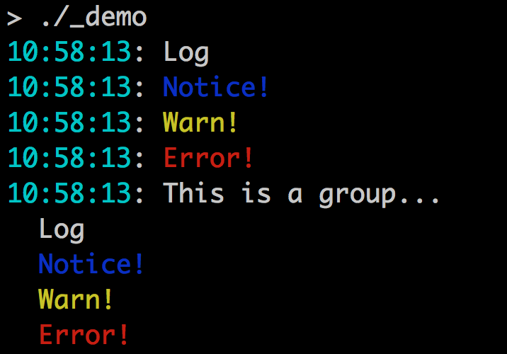

# termlog: Logging for interactive terminals

# Basic usage

    l := termlog.NewLog()
    l.Say("Log")
    l.Notice("Notice!")
    l.Warn("Warn!")
    l.Shout("Error!")

Each log entry gets a timestamp.

# Groups

Groups collect entries together under a single timestamp, with subsequent lines
indented:

    g = l.Group()
    g.Say("This line gets a timestamp")
    g.Say("This line will be indented with no timestamp")
    g.Done()

Groups produce no output until the .Done() method is called - a good use for
defer. Termlog ensures that all grouped entries appear together in output.

# Streams

Streams associate log entries with a header. New stream log entries only get a
header if another log source (i.e. a different stream, group, or plain log) has
produced output in the meantime. Each stream log entry gets its own timestamp.

    g = l.Stream("This is the header")
    g.Say("The header will be printed before this line")
    g.Say("But not before this one")
    g.Done()

# Named logs

Log entries can be named using the *As methods:

    l := termlog.NewLog()
    l.Say("hello")
    l.SayAs("debug", "Some debugging info")

Named entries are always silenced, unless they've been enabled specifically, like so:

    l.Enable("debug")

# Specified colors

The package is compatible with the color specifications from
github.com/fatih/color, which means that colors can be composed like this:

    l.Say("Here are some composed colors...")
    l.Say(
    	"%s %s %s",
    	color.RedString("red"),
    	color.GreenString("green"),
    	color.BlueString("blue"),
    )
